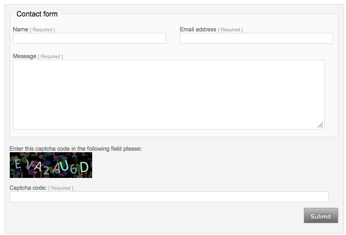

# How to implement a CustomHtmlForm

With ourCustomHtmlForm module you finally have full control over your forms markup, validation and javascripting. 

All it takes are 4 simple steps:
 - define a form via a multidimensional array, 
 - define an action method
 - create a unique template 
 - inject the form in any controller

Custom HTML-markup for form field types is optional.

## Simple Example: A Contact Form
- - -

### Installation of CustomHtmlForm

#### GitHub
Download the module from our GitHub repository. You can check it out with git:

    git clone git@github.com:silvercart/customhtmlform.git

If you do not want to clone the git-repository you can just [download the CustomHtmlForm module as a zip-file.](https://github.com/silvercart/customhtmlform)

#### Composer
You can also install CustomHtmlForm with composer.
    composer require "silvercart/customhtmlform"

If you are not familiar with Composer this tutorial will bring you up to speed in no time: [Installing and Upgrading SilverStripe with Composer](https://docs.silverstripe.org/en/3.3/getting_started/composer/) 

### Form Definition

Our contact form will have three distinct fields: 
* Name
* email address
* message

All the fields are required fields and the email address will be validated. Additionally, the name and the message have a minimum length of 3 characters. 

The class ContactForm resides in a file named 
    mysite/code/ContactForm.php.

###### ContactForm.php
	:::php
	<?php
	
	class ContactForm extends CustomHtmlForm {
	
		/**
		 * List of form fields with properties
		 *
		 * @var array
		 */
		protected $formFields = array(
			'Name' => array(
				'type' => 'TextField',
				'title' => 'Name',
				'checkRequirements' => array(
					'isFilledIn'    => true,
					'hasMinLength'  => 3
				)
			),
			'Email' => array(
				'type'  => 'TextField',
				'title' => 'Email address',
				'value' => '',
				'checkRequirements' => array(
					'isFilledIn'        => true,
					'isEmailAddress'    => true
				)
			),
			'Message' => array(
				'type'  => 'TextareaField',
				'title' => 'Message',
				'checkRequirements' => array(
					'isFilledIn'    => true,
					'hasMinLength'  => 3
				)
			)
		);
	
		/**
		 * basic preferences of the form
		 *
		 * @var array
		 */
		protected $preferences = array(
			'submitButtonTitle' => 'Submit'
		);
	
		/**
		 * Fills the form fields labels and values (if needed)
		 *
		 * @return void
		 */
		protected function fillInFieldValues() {
			$member = Member::currentUser();
			if ($member) {
				$this->formFields['Name']['value']  = $member->Surname;
				$this->formFields['Email']['value'] = $member->Email;
			}
		}
	
		/**
		 * Sends the contact message in case of a successful submission.
		 *
		 * @return void
		 */
		protected function submitSuccess($data, $form, $formData) {
			$email = new Email(
							'info@silvercart.org',
							'contact@silvercart.org',
							'contact form request',
							''
			);
			$email->setTemplate('MailContact');
			$email->populateTemplate(
					array(
						'Name'    => $formData['Name'],
						'Email'   => $formData['Email'],
						'Message' => str_replace('\r\n', ' ', nl2br($formData['Message']))
					)
			);
			$email->send();
		}
	
	}

The method fillInFieldValues() makes it easier for logged in clients by filling in the values for the known fields name and email address. 
With the array $preferences the form can be customized. In this we are redifining the submit button's title.

With 'type' ⇒ 'TextField' the Sapphire form field type will be defined.

### Form Validation

You can configure several input validation functions via “checkRequirements”:

* **hasSpecialSigns:** Define an amount of input characters to match.	
* **hasMinLength:** Define a minimum character length. Maybe you do not want to allow usernames with only 2 characters on a registration form.
* **hasSpecialSigns:** Check if special signs are contained in an input.
* **isCurrency:** Is the input a currency figure?
* **isDate:** Does the input have the date format “dd.mm.yyyy”?
* **isEmailAddress:** Validates an email input with preg_match(). This function does not check the existence of an email address.
* **isFilledIn**
* **isFilledInDependantOn:** This field must be empty if a dependent field is not filled in.
* **isNumbersOnly**
* **mustEqual:** The input of this field must equal an other fields input. On a registration form you might require a password input twice.
* **mustNotEqual**

### Form Action

The method submitSuccess() is the forms action method. It is called only on a successful form validation. 
If validation fails, a user gets JavaScript error messages per field. If JavaScript is disabled, validation will be done server-side. 

### The Template

Save the form template in the file templates/Layout/ContactForm.ss.

###### ContactForm.ss
	:::php
	<form class="yform full" $FormAttributes >
		$CustomHtmlFormMetadata
		<fieldset>
			<legend>Contact Form</legend>
			

				

					

						$CustomHtmlFormFieldByName(Name)
					

				

				

					

						$CustomHtmlFormFieldByName(Email)
					

				

			

			$CustomHtmlFormFieldByName(Message)
		</fieldset>
		$CustomHtmlFormSpecialFields
		

			

				<% control Actions %>
				$Field
				<% end_control %>
			

		

	</form>

In this markup we call the fields we defined previously in $formFields by passing the field name as a parameter to  $CustomHtmlFormFieldByName(). 
With an iteration over “control Actions” the forms action fields (eg submit, cancel) are being called. It's easy, isn't it? 

## Injection

A controller determines what will be shown on a website. But since our form is not bound to a controller it will not be displayed.
To register the form we add one line of code to the controllers init() method:

	:::php
	/**
	 * Initializes the controller.
	 * Our contact for will be registered here.
	 * 
	 * @return void
	 */
	public function init() {
		parent::init();
	    $this->registerCustomHtmlForm('OurContactForm', new ContactForm($this));
	}

Last but not least, the form must be called in the controller's template:

	:::php
	$InsertCustomHtmlForm(OurContactForm)

Now the form is up and running.

## Custom Form Field Requirements
- - -

The example above intentionally left out some advanced features to keep it short and simple. 
But some forms may require a more profound input validation and you even might want to change the markup of a field type. 
You can use callbacks to adapt the form to your needs.

## Callbacks

Callbacks augment the input validation by an interference with the database. The user input is not only checked against some character combination rules but also by comparing the input with existing data. 
A registration form is a good example. If email addresses should be unique inside your database, you must check any email address input against all existing email addresses.

Within checkRequirements a function “doesEmailExistAlready” is defined as a callback. A callback must return a boolean value plus an error message.

	:::php
	<?php
	
	/**
	 * Form to register a new Member
	 */
	class RegistrationForm extends CustomHtmlForm {
		
		/**
		 * List of form fields with properties
		 *
		 * @var array
		 */
		protected $formFields = array(
			'Email' => array(
				'type'  => 'TextField',
				'title' => 'email address',
				'checkRequirements' => array(
					'isEmailAddress'    => true,
					'isFilledIn'        => true,
					'callBack'          => 'doesEmailExistAlready'
				 )
			)
		);
	
		/**
		 * Form callback: Does the entered Email already exist?
		 *
		 * @param string $value the email address to be checked
		 *
		 * @return array
		 */
		public function doesEmailExistAlready($value) {
			$emailExistsAlready = false;
			$results = DataObject::get_one(
				'Member',
				"Email = '" . $value . "'"
			);
			if ($results) {
				$emailExistsAlready = true;
			}
			return array(
				'success' => !$emailExistsAlready,
				'errorMessage' => _t('SilvercartPage.EMAIL_ALREADY_REGISTERED', 'This Email address is already registered')
			);
		}
	}

## Use Simple Spam Protection
- - -

To activate a simple captcha spam protection for a CustomHtmlForm, there is a simple way to do that by calling the following code inside your projects _config.php:

	:::php
	CustomHtmlForm::useSpamCheckFor('ContactForm');

Now, the ContactForm will be extended with a captcha input field.

**To use this feature for one of your forms it's important to add the $CustomHtmlFormSpecialFields to your forms template. We did that above in our ContactForm.ss example.**

## Custom validation classes
Depending on the framework you use for HTML and CSS, you might want to change the classes used for the error hints.

You can change them by adding the following lines to your project's _config.php and changing them according to your needs:
    :::php
    CustomHtmlForm::$custom_error_box_css_class = 'help-inline';
    CustomHtmlForm::$custom_error_box_selection_method = 'append';
    CustomHtmlForm::$custom_error_box_sub_selector = ' .controls';

Do not forget to change the corresponding templates.